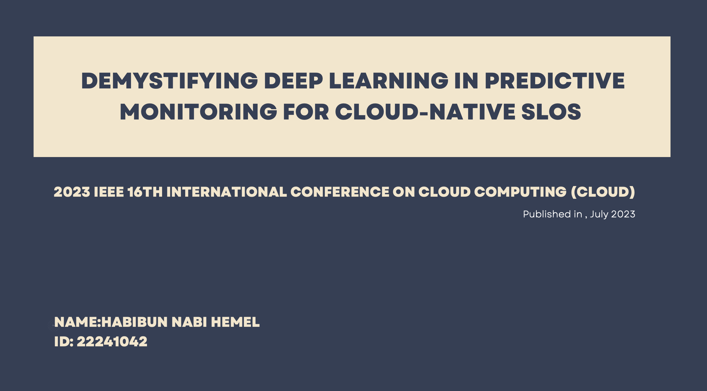
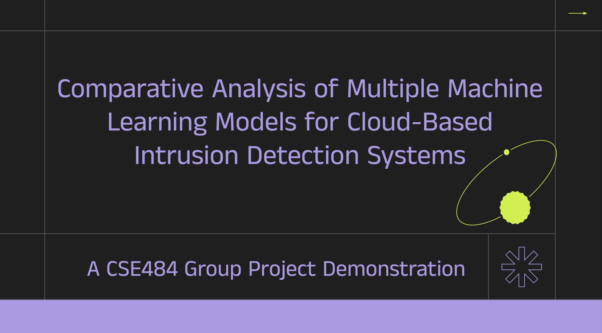

```
 CLOUD COMPUTING - CSE484
```

## Topics that are covered in the couse:
- characteristics of Cloud computing
- Deployment and service Model
- Virtualization Overview
- Virtualization Types
- Containerization Overview
- Docker commands
- Storage Systems Distributed Hashing Ring
- Consistent Hashing Ring
- The Evolution of Storage
- Swift’s Data Model and Architectures, Swift Basics
- OpenStack Swift installation, Advanced API Features
- Developing Swift Middleware, OpenStack Component
- Broker, Cache.
<br><br>

## 1. Lab Presentation
I had to give a presentation solo on a parer which explores how deep learning models like LSTM and Transformer can predict and optimize Service-Level Objectives (SLOs) in cloud computing. It focuses on using real-world cloud data to train models that anticipate and prevent performance issues. The study finds that while both models perform well, the Transformer model excels in handling new data and unexpected scenarios. The research integrates findings with the Polaris SLO Cloud framework for real-time cloud management. Future work aims to refine long-term predictions and implement models in real-world cloud systems.

<p align="center">
  
  <br>
  <br>
  Figure 1: Solo Presentation
</p>
<br>


### 2. Project work on a Paper **"Summary of Comparative Analysis of Multiple Machine Learning Models for Cloud-Based Intrusion Detection Systems"**  

### Made by:
---
#### Habibun Nabi Hemel  
#### Zonayed Hossain Siyam 
#### Sakib Badhon
---

This project aims to evaluate multiple machine learning models for intrusion detection and deploy the best-performing model on a cloud-based system.  

#### **Key Objectives:**  
1. Test various machine learning models to determine the most suitable for intrusion detection.  
2. Deploy the best-trained model on a cloud server.  
3. Use the server as a middleman to enhance website security.  

#### **Dataset:**  
- **Intrusion Detection Dataset** from Kaggle, containing network traffic features for training models.  

#### **Machine Learning Models Used:**  
- **Classification models tested:** Random Forest, KNN, Logistic Regression, AdaBoost, Naïve Bayes.  
- **Best model chosen:** **Random Forest**, based on performance.  

#### **Deployment:**  
- The model is deployed using **Streamlit** as a middleman for security.  
- A demo is provided, but a full-fledged website could not be built due to time constraints.  

#### **Conclusion:**  
- The model is not 100% accurate, so some errors may occur.  
- Future work includes implementing more advanced ML models to improve detection.  

<p align="center">
  
  <br>
  <br>
  Figure 1:  Project Presentation
</p>
<br>


Our project is live on https://cse484.streamlit.app/

